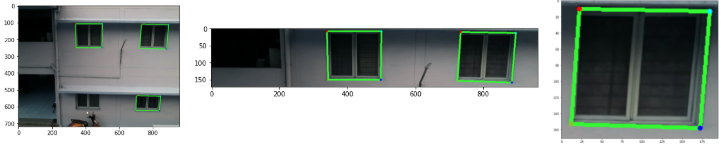
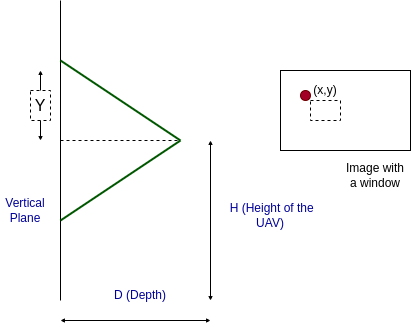
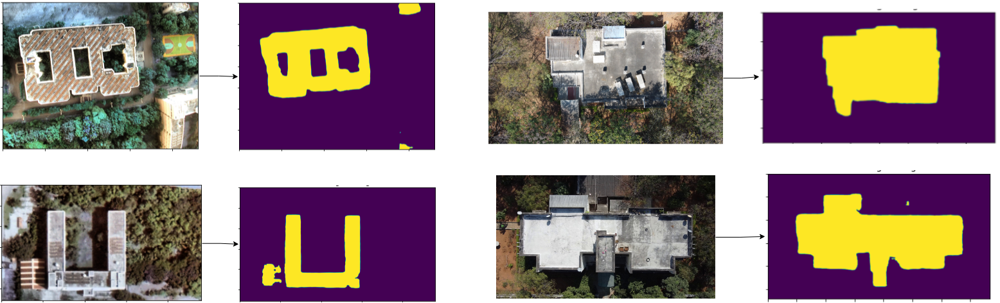

# Drone-based-building-assessment
### Readme Update(In Progress)

### Project - "Identification of salient structuaral elements from buildings using UAVs"
The project aims to extract information such as planShape/Area, Storey and window count, their height and so on of the buildings from the camera feed through drone. It is a part of IHub - Mobility Research at IIIT Hyderabad.

#### Objectives of Pilot Study:
To identify salient structural elements in buildings from RGB images captured using a UAV.
1) Number of windows
2) Number of storeys
3) Storey height (Uniform/varied storey heights)
4) Building Plan estimation

#### Dataset:
We have made our own custom dataset by capturing buildings on IIIT-H campus through a drone. In addition, we have also used the open-source zju_facade dataset to train our models. IIIT-H campus window dataset can be found [here](https://drive.google.com/drive/folders/1fxJP8x9y8I23DFWardhpMM5BZAUY4WtM?usp=sharing).

       

For window detection task (The ground truths are bounding boxes shown in red)

 

  

For plan-shape/area (The ground truths are segmented masks in white)

### Progress till now:
Please find our current progress in the following presentation.
<a href="https://docs.google.com/presentation/d/1Oj5h2Y_G0Geoxrf7Ti8xwFlPiwgsrAcYaunN2R8y6zE/edit?usp=sharing" target="_blank">Presentation Link</a>

### Window detection

Shufflenet inference

 
As shown in the above fig., we have the detected windows from the model inference(Shufflenet from win_det_heatmaps). However, we see that some windows still go undetected. Hence, we have a designed a post-processing module 

 

Post-processing module:

We take the detected windows as templates and run them over the horizontal patch in the image. We try to match this template in the patch and detect the windows which we were previously not detected. 
 

Model inference(left), Horizontal Patch
(middle), Template (right)

Post processing results

As shown in the fig. above, the post processing module detects all windows successfully.
 
 
 

### Storey/Building height estimation:

As shown in the fig. above, we make use of Depth(D), focal
length of the camera(f), height of the UAV(H) and image
coordinates(x,y) are used to map the coordinates of each
detected window from the image to a 2D vertical plane using
triangulation. 

 

2D Vertical Plane Mapping(Before and After NMS)

The above vertical plane helps us get an estimate of distance between 2 consecutive vertical windows. Although we have the imaginary vertical plane(scaled in cm), we cannot use this directly to
estimate storey heights. This is because the vertical plane
also includes the ground plane. Due to this, the estimated
height increases by the proportion of ground plane pixels
and therefore it needs to be accounted for. As it depends
on the start frame and also the camera’s FOV, it is difficult
to generalize it in different scenarios, hence we rely on
3D reconstruction for this.

 

1 unit (mesh) = ∇Wij /∇wij
 
where ∇Wij represents the distance between consecutive
windows in cm, estimated from Plane Mapping Approach
whereas ∇wij represents the distance between same two
windows in the units of mesh from SFM reconstruction

Now, we use the unit scale to estimate the building/storey heights in the 3D reconstruction.
 
 

### Plan Shape/Area Estimation :
We use RefineNet from [building-footprint-segmentation](https://github.com/fuzailpalnak/building-footprint-segmentation) and fine-tune it on our dataset consisting of GoogleEarth & IIIT-H campus(captured using UAV), which consists of around 200 images.

Inference

Sample results from the dataset

#### Area Estimation:
Now, we estimate the area(in m²) from the contour Area of the segmented building mask. \
  Area(in m²) = Contour Area(in pixels)*(D/f)² \
  D: Depth(in m)
  f: focalLength(in pixels)
  
 
 

### Project Team:
Dhruv Patel - Project Associate, Robotics Research Centre(RRC), IIIT Hyderabad \
Shivani Chepuri - MS Student, IIIT Hyderabad \
Sarvesh Thakur - MEng Robotics, University of Maryland 

Advisors: \
Prof. Madhava Krishna (Head & Professor, RRC, IIIT Hyderabad) \
Dr. Harikumar Kandath (Assistant Professor, IIIT-Hyderabad) \
Dr. Ravi Kiran Sarvadevabhatla (Assistant Professor, IIIT-Hyderabad)
