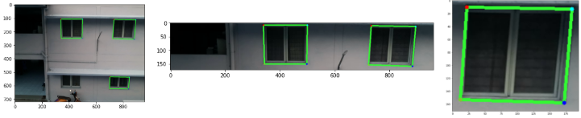
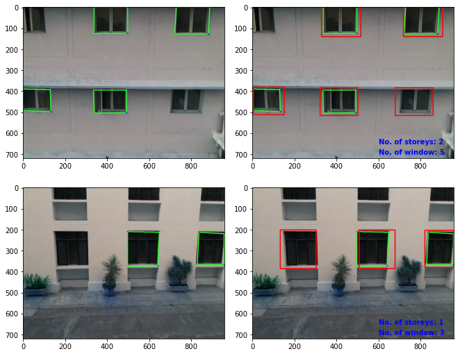

# Post-processing module
A python class integrating Template matching and Non-maxima suppression employed to account for the failure cases of window detection model.
This class is called during model inference ([infer.py](../infer.py)), where it generates a CSV file containing window coordinates for the entire vertical sequence.

Model inference(left), Horizontal Patch
(middle), Template (right)

Post processing results

As shown in the fig. above, the post processing module detects all windows successfully.